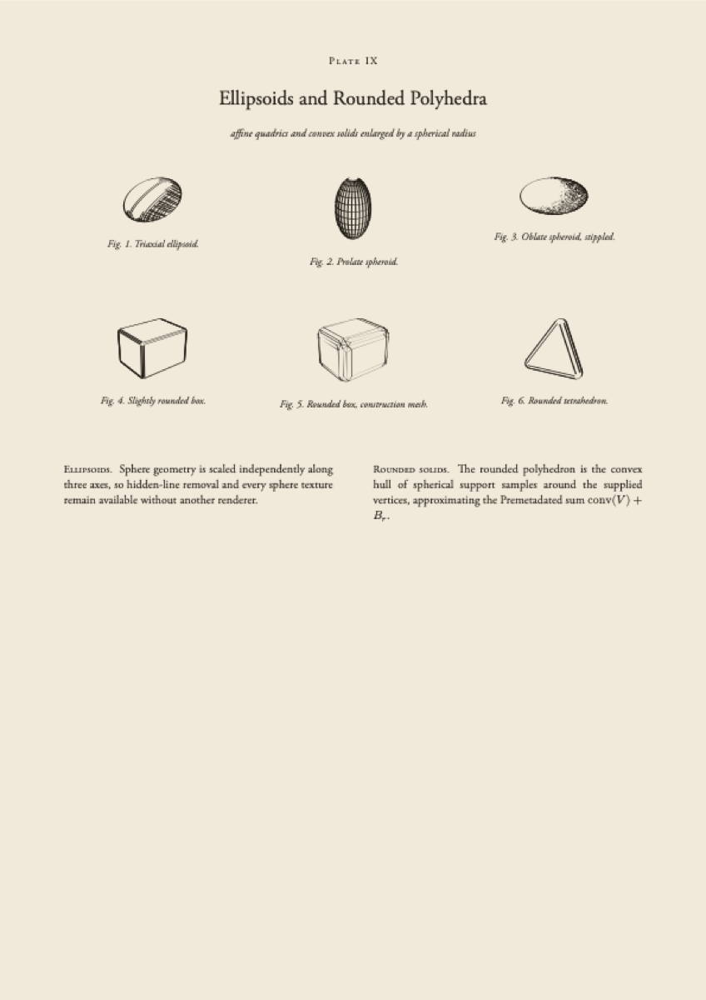
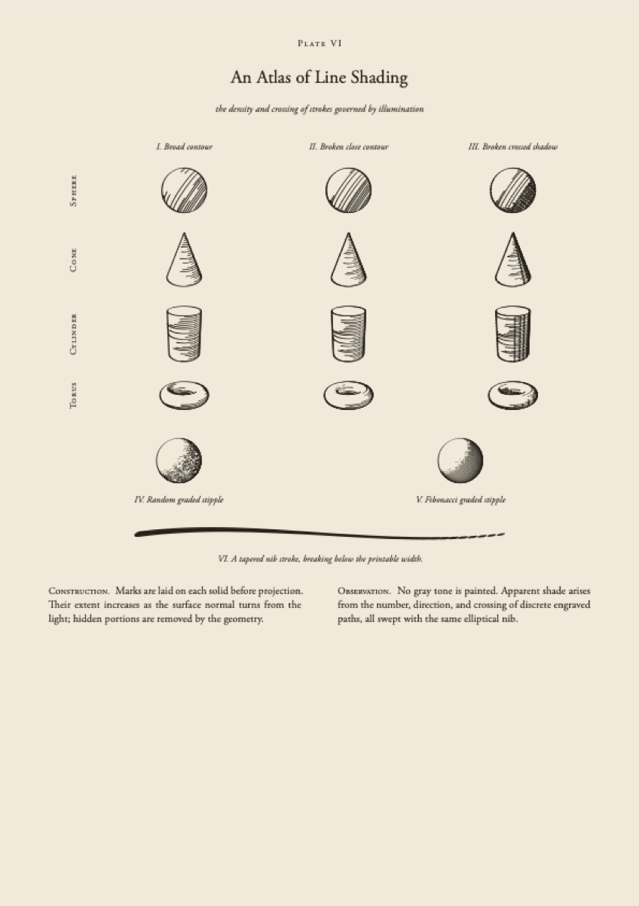
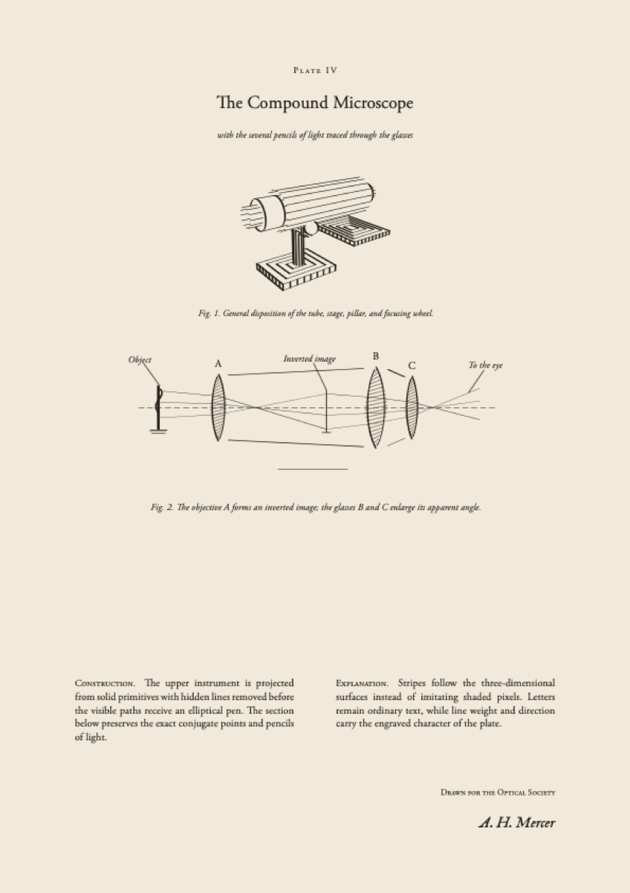

# Premetadated

Vintage scientific illustration for Typst, with elliptical-pen strokes,
hidden-line 3D rendering, lighting-aware hatching, stippling, optics, and
mechanical drawing helpers.

[](LICENSE)
[](https://typst.app)

Premetadated combines a Typst/Cetz interface with a bundled Rust/WASM geometry
engine. It is intended for diagrams that should remain crisp, searchable, and
slightly older than their metadata suggests.

## Gallery

<table>
<tr>
<td width="33%"></td>
<td width="33%"></td>
<td width="33%"></td>
</tr>
<tr>
<td align="center">Rounded solids</td>
<td align="center">Shading atlas</td>
<td align="center">Optics plate</td>
</tr>
</table>

More complete plates are in [`examples/`](examples/). The package reference and
worked examples are in [`manual.typ`](manual.typ); a compiled copy is available
as [`manual.pdf`](manual.pdf).

## Quick start

From a repository checkout:

```typ
#import "lib.typ" as premetadated

#let geo = premetadated.geometry
#let draw = premetadated.illustration

#show: premetadated.style.plate.with(
  number: [Plate I],
  title: [Elementary Solids],
  subtitle: [surface lines governed by illumination],
)

#align(center, draw.canvas({
  geo.render(
    geo.sphere(
      (0.0, 0.0, 0.0),
      1.0,
      pattern: (geo.texture.lit-hatch)(
        light: (1.0, -0.35, 1.0),
        count: 620,
        crosshatch: 0.76,
      ),
    ),
    eye: (4.2, 5.2, 3.0),
    width: 5.0,
    height: 5.0,
    pen: (0.022, 0.006, 24deg),
  )
}))
```

Once released through Typst Universe, the equivalent package import will be:

```typ
#import "@preview/premetadated:0.1.0"
```

## Namespaces

| Namespace | Purpose |
| --- | --- |
| `stroke` | Cubic paths, elliptical nib envelopes, dashes, and pressure breakup |
| `geometry` | 3D primitives, textures, projection, and hidden-line rendering |
| `illustration` | Canvas, palette, engraved rules, labels, SVG gestures, and captions |
| `optics` | Standalone 2D ray tracing, optical elements, scene import, and paths |
| `optics-illustration` | Projection and engraved rendering of imported optics scenes |
| `mechanics` | Rod, collar, joint, and lit-joint constructors |
| `style` | Example, engraved plate, and patent-sheet templates |

Available 3D primitives include spheres, ellipsoids, cubes, cylinders, cones,
tori, generic swept tubes, rounded boxes, and rounded convex polyhedra. Surface
styles include outlines, stripes, latitude/longitude grids, random circles,
lighting-aware hatching, and stippling.

## Ray optics

The dependency-free `optics` module traces finite beams and point sources through
ideal thin lenses, line mirrors, blockers, apertures, and beam splitters. It
returns point arrays rather than drawing directly, so it can later be extracted
from Premetadated or rendered with another backend.

```typ
#let optics = premetadated.optics
#let scene = (
  rays: optics.beam-source((-4, -1), (-4, 1), count: 9),
  elements: (
    optics.ideal-lens((-1, -2), (-1, 2), 2.5),
    optics.aperture((1, -2), (1, 2), (1, -0.6), (1, 0.6)),
  ),
)
#let traces = optics.trace-scene(scene, max-distance: 6)
```

`optics.import-ray-optics(json("scene.json"))` imports the supported linear
subset of [Ray Optics Simulation](https://github.com/ricktu288/ray-optics)
scenes: `Beam`, `SingleRay`, `PointSource`, `IdealLens`, `Mirror`,
`BeamSplitter`, `Blocker`, `Aperture`, and `CropBox`. See
[`examples/kohler.typ`](examples/kohler.typ) for a complete computed plate.

Use `optics-illustration` when the imported scene should be traced, projected,
and engraved with the package's standard optical vocabulary:

```typ
#let draw = premetadated.illustration
#let optical-drawing = premetadated.optics-illustration
#let diagram = optical-drawing.import-scene(
  json("scene.json"),
  scale: 70,
  max-distance: 1200,
)

#draw.canvas({
  optical-drawing.draw(diagram)
  optical-drawing.label(diagram, (100, 200), [source])
})
```

## Build and verify

The checked-in `elliptical_pen_envelope.wasm` is ready for Typst. Rebuild it
after changing Rust geometry or the binary protocol:

```sh
cargo test --all-features
cargo build --release --target wasm32-unknown-unknown --features typst-plugin
cp target/wasm32-unknown-unknown/release/elliptical_pen_envelope.wasm .
typst compile --root . manual.typ manual.pdf
```

Compile an individual plate with the repository as the project root:

```sh
typst compile --root . examples/solids.typ examples/rendered/solids.pdf
```

## Credits and license

Premetadated directly builds on Cetz and Larnt, with Larnt continuing the lineage
of Michael Fogleman's `ln`. Its visual and procedural vocabulary owes a great
deal to MetaPost, Fiziko, and vintage-latex. See
[`ACKNOWLEDGMENTS.md`](ACKNOWLEDGMENTS.md) for precise dependency, adaptation,
and asset credits, including the temporary Twemoji placeholders.

Premetadated is licensed under the [Mozilla Public License 2.0](LICENSE).
Third-party components and assets remain under their respective licenses.
